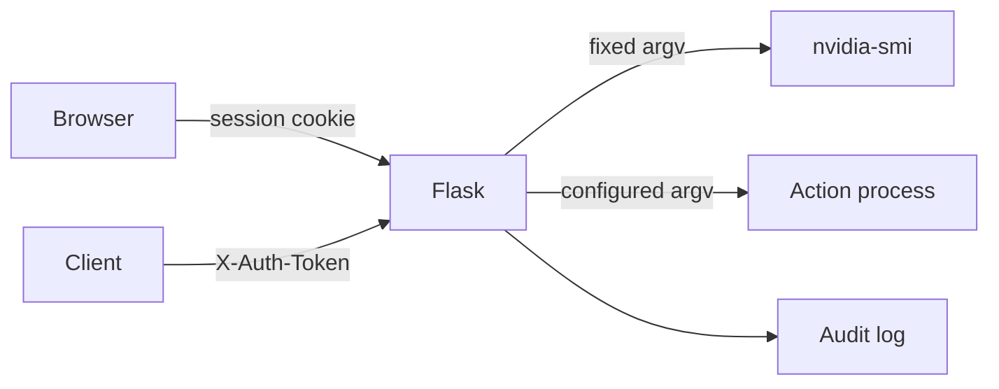

# Architecture

The browser talks to a single Flask/Gunicorn service. Login creates an
HTTP-only, same-site session cookie. API clients may instead use a fixed token
from the `AUTH_TOKEN` environment variable.

`GET /api/status` executes the fixed `nvidia-smi` command.
`POST /api/action/<name>` looks up a preconfigured argument array in
`instance/config.json` and executes it without a shell. Both endpoints require
authentication. `GET /healthz` is intentionally public for container health
checks.

Actions run as the non-root container user. The root filesystem, configuration,
and action scripts are read-only; the audit-log directory is the only persistent
writable mount.

